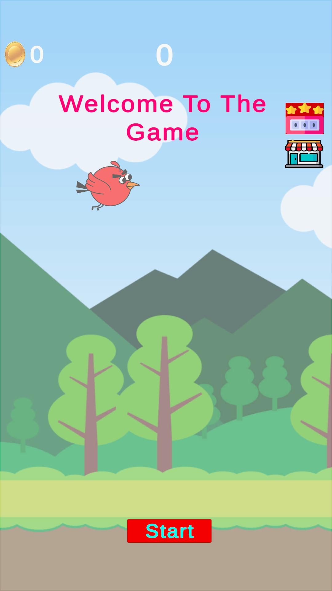
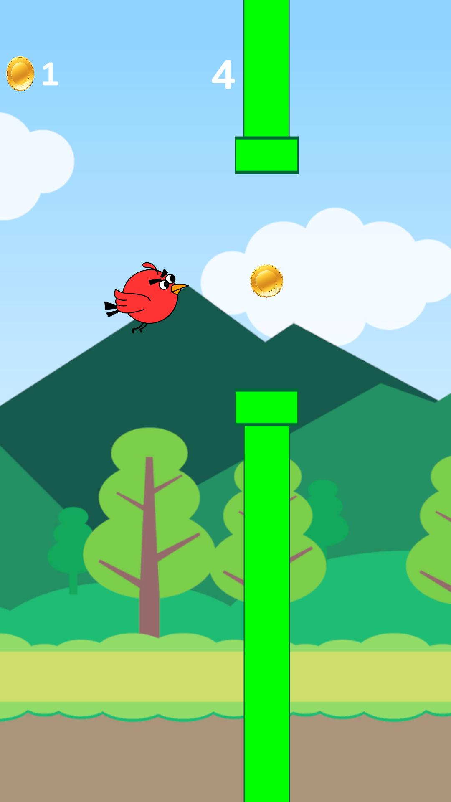
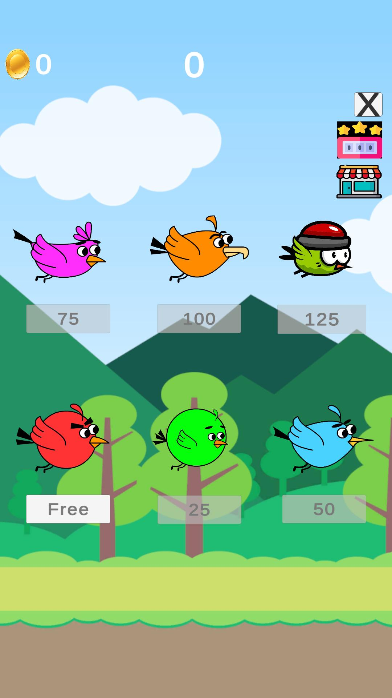
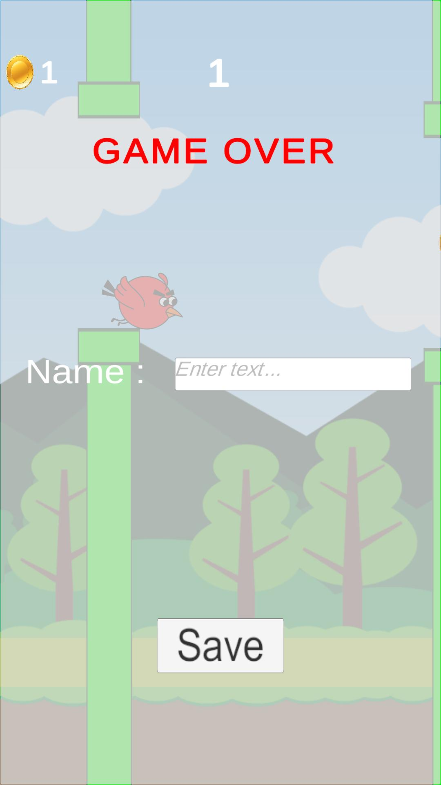
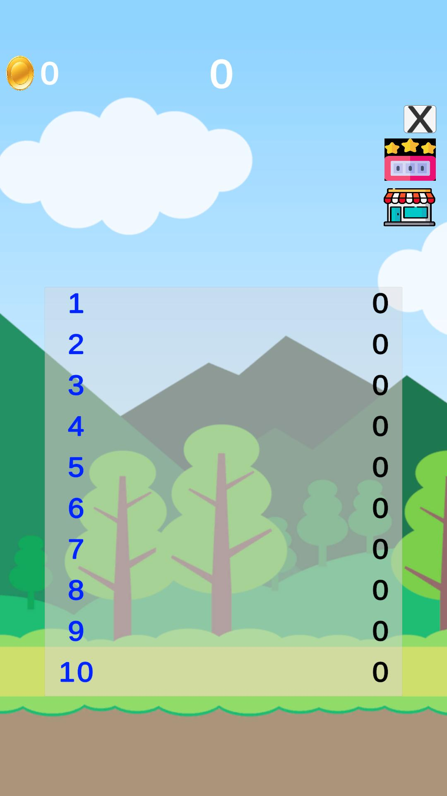
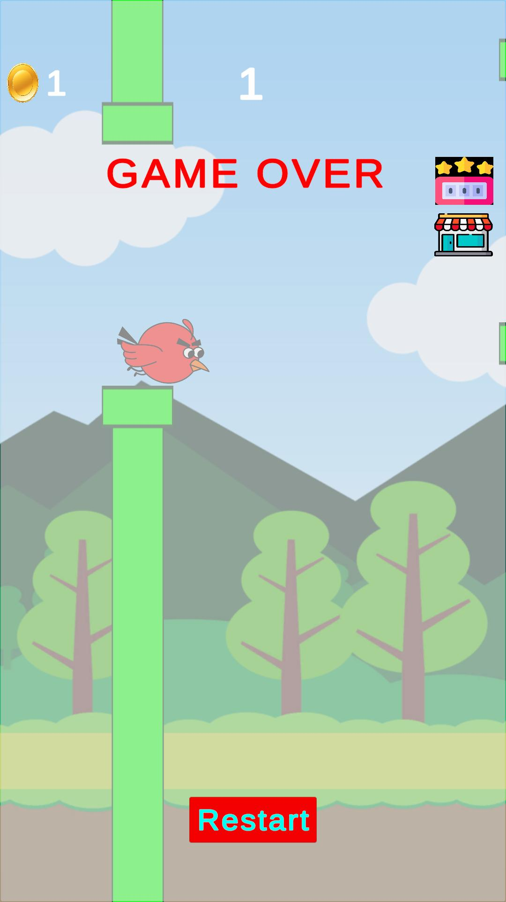
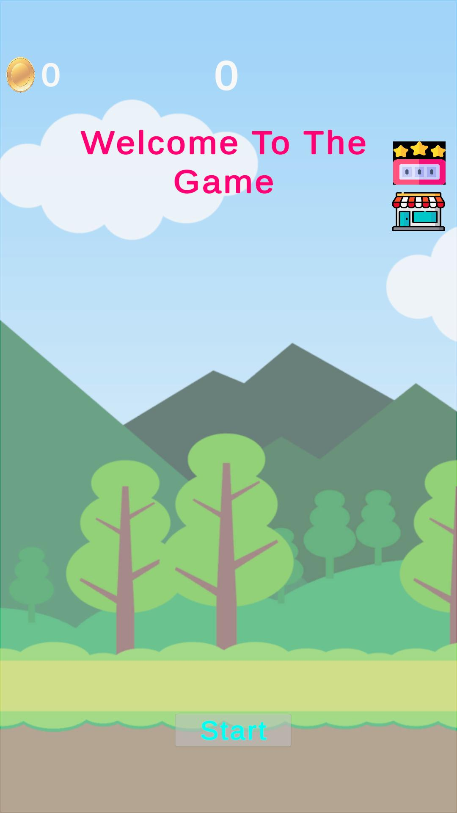

  <h1>Flappy Bird</h1>

## About the Project

This project is a clone of the classic Flappy Bird game, with numerous customized enhancements. The objective is to pass through gaps between obstacles without hitting them and achieve the highest possible score. This customized version includes features like a marketplace system and a score ranking system.

 

 

## How to Play

&nbsp;&nbsp;&nbsp;1.Select a bird before starting the game.

&nbsp;&nbsp;&nbsp;2.Press the "Start" button to begin.

&nbsp;&nbsp;&nbsp;3.Avoid hitting obstacles and try to collect gold.

&nbsp;&nbsp;&nbsp;4.Unlock new birds by collecting enough gold and use them in your gameplay.

&nbsp;&nbsp;&nbsp;5.Achieve the highest score to rank first on the leaderboard!

## Game Mechanics

Controls: The player flaps their bird to pass through gaps between obstacles. Each successful pass earns 1 point.

Marketplace System:

&nbsp;&nbsp;&nbsp;-The game features 6 different birds.

&nbsp;&nbsp;&nbsp;-The first bird is free and must be selected before starting the game. Without selecting a bird, the game cannot begin.

&nbsp;&nbsp;&nbsp;-The other birds can be unlocked using gold collected during gameplay.

&nbsp;&nbsp;&nbsp;-Gold appears with a 20% chance as the player passes through obstacles.

&nbsp;&nbsp;&nbsp;-Purchased birds remain unlocked even if the game is closed and reopened.

## Score and Ranking System

### Score Recording System:

&nbsp;&nbsp;&nbsp;-Players earn points for every gap they successfully pass through.

&nbsp;&nbsp;&nbsp;-If no obstacles are passed, the score is not recorded.

&nbsp;&nbsp;&nbsp;-If a player achieves at least 1 point, the gameplay results are recorded.

&nbsp;&nbsp;&nbsp;-The system keeps track of scores for 10 gameplay sessions.

&nbsp;&nbsp;&nbsp;-During the 11th session, if the player surpasses the score in the 10th slot, their score is added to the list. Otherwise, it is not recorded, and the registration screen does not appear.

### Score List:

&nbsp;&nbsp;&nbsp;-The score list contains 10 slots.

&nbsp;&nbsp;&nbsp;-Players are ranked appropriately on the list with each new high score.

&nbsp;&nbsp;&nbsp;-The list is ordered from highest to lowest score.

## Technical Details

### Gold Collection Mechanism:

&nbsp;&nbsp;&nbsp;-Gold appears with a 20% chance after passing through each obstacle.

&nbsp;&nbsp;&nbsp;-Gold is collected when the bird passes over the gold.

### Marketplace Mechanism:

&nbsp;&nbsp;&nbsp;-Bird locks are unlocked when the required amount of gold is collected.

&nbsp;&nbsp;&nbsp;-Unlocked birds can be selected without spending gold again.

### Score Recording and Ranking:

&nbsp;&nbsp;&nbsp;-The highest score is checked and added to the list at the end of the game.

&nbsp;&nbsp;&nbsp;-Scores are added to the list based on whether they surpass the current lowest score.

## Screenshots

<table align="center">
  <tr>
    <td align="center">
      
Gold Collection Mechanism

      
    </td>
    <td align="center">
      
Marketplace Screen

      
    </td>
    <td align="center">
      
Registration Screen

      
      <tr>
    </td>
    <td align="center">
      
Score Ranking Screen

      
    </td>
    <td align="center">
      
Endgame Menu

      
    </td>
    <td align="center">
      
Birdunselected

      
    </td>
  </tr>
</table>

## Installation

To run the Flappy Bird game on your Windows system, follow these steps:

    1. Clone this repository or download it as a ZIP file.
    2. Open the project in Visual Studio or your preferred C++ IDE.
    3. Build and run the project.

### Downloading Release and Playing

You can easily download and play the game by following these steps:

&nbsp;&nbsp;&nbsp; 1. Go to the [Releases](https://github.com/aykutbaglan/FlappyBirdClone/releases) section of this repository.  
&nbsp;&nbsp;&nbsp; 2. Find the latest release and click on it.  
&nbsp;&nbsp;&nbsp; 3. Download the ` v0.0.1.zip ` file from the release.  
&nbsp;&nbsp;&nbsp; 4. Unzip the zip file.    
&nbsp;&nbsp;&nbsp; 5. Run`FlappyBirdClone.exe`to start playing the game !  
